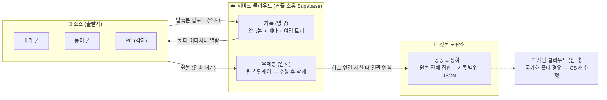

# HeartPin 개발 로드맵 & 아키텍처 결정 문서

> 작성일: 2026-06-05 · **갱신: 2026-06-06 (Phase 0 — 당일 데모 재편)** · 기준 코드: 프론트엔드 프로토타입 완성 (데이터 메모리 상태, [wisroo/HeartPin](https://github.com/wisroo/HeartPin))
>
> **문서 목적**: 백엔드 개발 범주·단계, 모바일 개선 단계, 저장/전송(클라우드·외장하드) 논의와 결정을 기록한다.
> MVP(1단계) 범위를 확정하고, 나머지는 추후 개발이 용이하도록 로드맵과 논의 근거를 남긴다.
>
> 정식 출시 운영, 개인정보, BYO cloud, E2EE 전략은 [정식 운영 로드맵](./OPERATIONS-ROADMAP.md)에서 별도로 관리한다.

---

## 1. 서비스 정의와 핵심 가치

**HeartPin(하트핀)** — 갤러리에 흩어진 사진을 예쁘게 정리하며 기록하는 커플 전용 웹.
Trip → Day → Spot → Moment 단위로 여정을 자동 정리하고, 지도 + 게임 감성 UI로 보여준다.

### 서비스가 맡는 것 / 맡지 않는 것

| 맡는 것 ✅ | 맡지 않는 것 ❌ |
|---|---|
| **기록으로서의 제공** — 압축본 + 설명 + 여정 트리의 영구 보존 | **원본 백업** — 원본은 각자 로컬/외장하드에서 관리 |
| **서로 간 전송의 용이성** — 클라우드 경유 중계(우체통) | 원본의 영구 클라우드 보관 |
| **소재 추적** — 어떤 사진이 어디(폰/PC/하드)에 있는지 아는 장부 | 타인 사진의 운영(SaaS) — 프라이버시상 배제 |

### 핵심 개념: "원장(臺帳, Ledger)" 모델

> 원본이 어디에 흩어져 있든(바라 폰, 뇽이 PC, 외장하드), **"무엇이 어디에 있고, 어디로 가야 하는지"를 아는 유일한 장부**가 된다. 파일 저장은 안 맡되, 소재 추적과 이동 지시를 맡는다.

- **기록은 공동, 원본은 소유자** — 콘텐츠 해시(SHA-256)가 원본↔압축본↔기록을 잇는 열쇠
- 기기끼리 직접 통신하지 않는다 — 모든 이동은 클라우드(기록+우체통)를 경유
- 동기화 규칙은 단 하나: **"외장하드(정본 보관소)가 전체 집합을 갖게 하라"**

---

## 2. 핵심 아키텍처 결정 (ADR)

| # | 결정 | 근거 | 배제한 대안 |
|---|---|---|---|
| **D1** | 기록(압축본+메타)은 **클라우드 필수** | 둘이 어디서나 봐야 함 — 로컬은 남이 못 보고, 외장하드는 꽂혀 있을 때만 존재 | 로컬 전용(IndexedDB): 기기 1대에 갇힘 |
| **D2** | 클라우드는 **"각 커플의 것"** (BYO-cloud) | 운영자가 타인의 사진을 관리하지 않음 — 개인정보 책임·비용·유출 리스크 구조적 제거 | 운영형 SaaS |
| **D3** | 1차 백엔드 = **Supabase** (서울 리전) | DB+Storage+Auth 올인원, 서버 코드 최소, 오픈소스(셀프호스팅 가능=락인 없음), 무료 티어 | Firebase(동급, 갈아탈 이유 없음) / FastAPI 전용 서버(운영 부담) / PocketBase(서버 운영 필요) |
| **D4** | **StorageAdapter 추상화** + 통째 내보내기 | 백엔드 교체 가능하게(추후 Google Drive 어댑터) · "내 데이터는 언제든 들고 나간다" 신뢰 장치 | Supabase 직결 하드코딩 |
| **D5** | 클라우드엔 **압축본만** (display 2000px + thumb 400px) | 원본 12MB → ~330KB(97%↓), 무료 1GB로 ~3,000장 · "백업 아님" 정체성 유지 | 원본 업로드(비용·정체성 충돌) |
| **D6** | **정본 보관소 = 공동 외장하드 1곳** (역할 고정) | 위치가 N개여도 규칙이 하나로 수렴 — 복잡도 폭발 방지 | NAS(사용자가 배제) / 모든 위치 대등 동기화 |
| **D7** | 인증 = **공유 계정 1개** + 캐릭터 owner 토글(바라/뇽이) | 2인 전용 — 회원가입/초대/권한 로직 불필요, 동시 쓰기 충돌 최소화 | 계정 2개+권한 모델(과함) |
| **D8** | 보관함 연결 = **File System Access API** | 웹앱이 로컬 파일을 읽고·쓰고·지울 유일한 표준 방법. 핸들 영속화로 재연결 1클릭 | Electron/네이티브(배포 부담) |
| **D9** | 사람·기기 간 전송 = **클라우드 경유 (우체통: 임시 중계 후 삭제)** | 폰↔PC가 시간차를 두고 만나도 됨 · "백업 X, 전송 O" 목표와 일치 | P2P(WebRTC): 동시 접속 필요, 복잡도 대비 가치 낮음 |
| **D10** | 모바일 = **Mobile shell + Capacitor dev app spike 우선** | Android 브라우저 사진 선택기가 위치 EXIF를 제거하는 문제가 확인됨. 업로드 신뢰성은 native photo permission 경로로 먼저 검증하고, UI는 기존 Mobile shell을 재사용 | React Native 재작성(+1~2달) / 웹 input 우회만으로 해결 |
| **D11** | 커스텀 서버 코드는 **Vercel Functions로 최소화** (JS·Python 혼용 가능) | Supabase가 API 대체. LLM/Mapbox 키 은닉, HEIC 처리 등 필요한 함수만 | FastAPI 상시 서버(불필요) |
| **D12** | **Phase 0 데모 = 로컬 Express 서버** (Mac, 같은 네트워크 — 임시) | 6시간 시연: 폰 2대 업로드→지도 기록→하드 저장. 하드가 서버 머신에 직결 → Node fs 직접 쓰기로 **FS API·우체통 없이 "폰→하드"가 한 홉** · record.json 필드를 Supabase 스키마와 동일하게 유지해 전환 보장 | Supabase 압축 일정(6시간 내 불가) / FS Access API(폰 미지원) |

---

## 3. 시스템 구조

### 데이터 흐름



### 위치별 역할 고정 (D6)

| 위치 | 역할 | 서비스가 하는 일 |
|---|---|---|
| **공동 외장하드** | **정본 보관소 (유일)** | "전체 집합이 여기 모이게 한다" — 빠진 사진을 큐로 수송, 흐릿 삭제 실행, 기록 백업 |
| 폰 (둘 다) | 출발지(소스) | 업로드 받기 · 하드 안착 후 **"폰에서 지워도 안전 ✓"** 표시 (웹은 카메라롤 삭제 불가 → 표시까지가 역할) |
| 개인 클라우드 | 개인 사본 (선택) | 직접 연동 X — 동기화 폴더(iCloud Drive/구글드라이브)에 써주면 OS가 올림 |
| 서비스 클라우드 | 기록(영구) + 우체통(임시) | 압축본·메타·여정 트리 영구 / 원본은 전송 동안만 |

### Phase 0 데모 구조 (임시 — 2026-06-06)

정식 구조(위)로 가기 전, 당일 시연을 위해 클라우드 자리를 **Mac의 로컬 Express 서버**가 임시로 맡는다.
하드가 서버 머신에 직결되어 있어 "폰→하드 수송(우체통)"이 업로드 한 홉으로 끝난다.

```
폰(바라·뇽이) ──같은 Wi-Fi──→ Mac Express 서버(:3300) ──Node fs──→ 외장하드(HEARTPIN_VAULT)/HeartPin/
                              · EXIF·SHA-256·압축 처리              ├ originals/YYYY-MM/  (원본)
                              · 앱(dist)·압축본 서빙                 ├ display/ · thumb/   (WebP 압축본)
                              · 3초 폴링으로 양쪽 화면 동기화         └ record.json        (기록 트리 = 원장)
```

- `record.json`의 필드는 아래 Supabase 스키마와 **동일** — Phase 1 전환은 "api.js 구현 교체 + 일회성 마이그레이션 스크립트"로 끝나도록 보장
- 다른 장소에서도 동일 데모 가능: 폰 핫스팟에 Mac+폰을 붙이면 됨 (서버가 접속 주소 자동 출력)

### 데이터 모델 (Supabase 스키마 초안)

```sql
trips(id, region, title, start_date, date_label, tags, created_at)
days(id, trip_id, label, date)
spots(id, day_id, name, time, lat, lng, mood, guide, reaction, sort_order)
moments(
  id, spot_id, display_url, thumb_url, label, ratio, tint,
  content_hash,        -- SHA-256: 원본↔압축본↔기록 연결 열쇠 (Phase 1부터 필수)
  original_name, original_size, taken_at, lat, lng,
  owner,               -- 'bara' | 'nyong' (누구의 원본인지)
  original_status      -- 'kept' | 'discard_pending' | 'discarded' | 'lost'
)
inbox_items(id, kind, taken_at, lat, lng, display_url, thumb_url,
            label, blur, content_hash, original_name, owner)

-- Phase 3에서 추가
photo_copies(photo_id, location, status)        -- 위치별 사본 추적 (보관 현황)
transfer_queue(id, photo_id, dest, tmp_url, status, expires_at)  -- 우체통
```

- Storage 버킷: `photos/` (display·thumb) — **private + 서명 URL/RLS** (기본 비공개 PRD 준수)
- ⚠️ `content_hash`·`owner`는 **Phase 1부터** 넣는다 — 나중에 추가하면 기존 사진의 해시가 없다

### StorageAdapter 인터페이스 (D4)

```
앱 코드 ──→ src/api.js = StorageAdapter (인증 · 사진 저장 · 기록 CRUD · 정리함 CRUD)
              ├─ LocalServerAdapter ← Phase 0 (데모 — 로컬 Express 서버)
              ├─ SupabaseAdapter   ← Phase 1
              └─ DriveAdapter      ← Phase 5 (비개발자 확산 시)
```

연결 정보는 코드에 박지 않고 환경변수(`VITE_SUPABASE_URL`, `VITE_SUPABASE_PUBLISHABLE_KEY`)로 — BYO 배포의 전제.

---

## 4. 개발 로드맵

### Phase 0 — 데모 "로컬 시연" 🎬 (2026-06-06, ~6시간)

> **데모 정의**: 두 사람이 폰으로 로컬 배포 서비스에 접속해 사진을 올리면 **지도에 기록**되고,
> 원본·압축본·기록이 **연결된 외장하드에 저장**된다. — 시연이면서 MVP 테스트이자 사진 정리의 시작.

**재편 배경**: 원래는 분산된 사진(갤럭시·아이폰)을 외장하드로 모은 뒤 Phase 1부터 진행할 계획이었으나,
① 폰→Mac 사진 이동에 시간이 걸리고 ② 당일 시연이 우선이라, **폰에서 직접 올리는 경로(원 Phase 2~3 일부)를 로컬 서버 방식으로 앞당김** (D12).

| 작업 | 내용 | 시간 |
|---|---|---|
| 0-1. 로컬 서버 | Express+multer+sharp+exifr — 업로드 수신→EXIF·**SHA-256(서버 계산)**→2000px/400px WebP→하드 저장(`HEARTPIN_VAULT`)·`record.json` 영속화·앱/압축본 서빙 | ~1h |
| 0-2. 데이터 레이어 교체 | 메모리(HP_DATA) → **`src/api.js`(StorageAdapter 시임)** 경유 + 3초 폴링(상대 업로드 실시간 반영) · 샘플 데이터 제거(빈 상태에서 실데이터로 시작) | ~1.5h |
| 0-3a. 업로드 배관 | blob URL→서버 업로드 · 가짜 메타 폴백 제거→**'위치 없음' 플로우** — 기존 화면으로 동작 확인. **여기까지만 돼도 데모 성립** (0-3b 지연 시 폴백) | ~0.5h |
| 0-3b. 모바일 업로드 플로우 (디자인 핸드오프 #4) | **런치**(owner 첫 1회 선택+기기 기억 · D+N 자동 계산, 기념일 2024-06-29=D+1) → **고르기**(웹 번역: OS 사진 선택기→그리드 재확인) → **읽는 중**(실제 업로드 진행률) → **한 장씩 확인**(세션 부트스트랩: 자동 이름 "장소 N"→사용자 수정→이후 근접(300m) 제안 — 역지오코딩은 Phase 5 유지) → **완료**(스팟별 집계). 건너뛴·미배치 사진은 정리함으로 | ~2h |
| 0-4. 실기기 테스트 | 폰 2대 접속 — **아이폰 EXIF/HEIC**·AP isolation·Mac 방화벽. 0-3a 직후 1차, 0-3b 후 2차 | ~1h |
| 0-5. 보정 + 리허설 | 하드 폴더 검증·시연 동선 리허설 (압축) | ~0.5h |

**완료 기준(DoD)**
- [ ] 폰 2대가 각자 사진 업로드 → 정리함 배치 → Mac 지도에 기록 표시
- [ ] 하드에 원본(`originals/`)+압축본(`display/`·`thumb/`)+`record.json` 생성, 서버 재시작에도 유지
- [ ] 동일 파일 중복 감지(해시) + owner(바라/뇽이) 기록
- [ ] EXIF 없는 사진은 '위치 없음' 탭으로 (가짜 좌표 폴백 제거)
- [ ] 모바일: 런치→고르기→한 장씩 확인→완료 플로우로 업로드·배치 (디자인 핸드오프 #4)

**Phase 0에서 의도적으로 뺀 것**: Supabase · 로그인(같은 네트워크 한정이라 무인증) · FS Access API · 우체통 · 역지오코딩(장소명은 세션 부트스트랩으로 대체) · **모바일 홈·지도 셸**(와이어프레임 2·3번 미정 — 런치 화면이 임시 진입점)

### Phase 1A — 모바일 네이티브 업로드 Spike 📱 (~1–2일)

> **목표**: Play Store/App Store 배포 전, Capacitor dev build로 Android/iOS 실기기에 설치해 native photo picker가 EXIF/GPS를 보존하는지 확인한다.
> 진행 결과와 실기기 체크리스트는 [Capacitor 모바일 업로드 Spike 결과](./CAPACITOR-MOBILE-UPLOAD-SPIKE.md)에 기록한다.

| 작업 | 내용 | 공수 |
|---|---|---|
| 1A-1. Capacitor 스캐폴딩 | 기존 Vite/React 앱을 Android/iOS dev app으로 감싸기. MobileApp을 앱 엔트리로 유지 | ~0.5일 |
| 1A-2. Native media picker adapter | `webMediaPicker`와 `capacitorMediaPicker` 경계 생성. Android/iOS에서 사진 선택, metadata/EXIF, 원본 URI 읽기 검증 | ~0.5–1일 |
| 1A-3. 실기기 검증 | 갤럭시/iPhone에 개발 빌드 설치. 같은 사진을 web input/native picker로 비교해 lat/lng 보존 여부 기록 | ~0.5일 |

**완료 기준(DoD)**
- [ ] Android debug APK 또는 `npx cap run android`로 갤럭시 설치
- [ ] iOS Xcode dev install로 iPhone 설치
- [ ] native picker에서 GPS 보존 여부 확인
- [ ] 기존 web input 경로와 결과 비교 기록
- [ ] Supabase 업로드 구현 전에 사용할 mobile media adapter 계약 확정

### Phase 1B — MVP "기록의 시작" · Supabase 전환 🎯 (~4.5–5.5일)

> **MVP 정의(확정)**: 외장하드 연결로 웹에서 데이터를 업로드해서 기록하고,
> 상대방도 접속 가능하게 하여 양쪽 모두 데이터를 업로드할 수 있도록 한다.
>
> Phase 0 산출물(api.js 시임 · 업로드 파이프라인 로직 · 하드 폴더/record.json 포맷) 재사용으로 원 추정 5–6일에서 소폭 단축.

| 작업 | 내용 | 공수 |
|---|---|---|
| 1-1. Supabase 셋업 | 프로젝트(서울)·스키마·RLS·private 버킷·공유 계정 | ~1일 |
| 1-2. api.js 구현 교체 | LocalServerAdapter → SupabaseAdapter (데이터 레이어 교체 자체는 Phase 0에서 완료) | ~1일 |
| 1-3. 업로드 파이프라인 이전 | 압축을 클라이언트로 이전(서버리스 전환) + Storage 업로드 — EXIF·해시·owner·중복 감지 로직은 Phase 0 재사용 | ~1일 |
| 1-4. 보관함(외장하드) 연결 | FS API: 폴더 선택→핸들 영속화→스캔/해시 매칭→새 사진 복사·흐릿 삭제(`discard_pending` 큐) — 폴더 구조·record.json 포맷은 Phase 0에서 확정됨 | ~1–1.5일 |
| 1-5. 로그인 화면 + Vercel 배포 연결 | 공유 계정 로그인, 환경변수 분리 | ~0.5일 |
| 1-6. Phase 0 데이터 마이그레이션 | `record.json` → 테이블 insert + 하드 압축본 → Storage 업로드 (일회성 스크립트) | ~0.5일 |

**완료 기준(DoD)**
- [ ] 두 사람이 각자 PC에서 로그인 → 사진 업로드 → 기록 생성, 새로고침·다른 기기에서도 유지
- [ ] 업로드 시 owner(바라/뇽이) 기록, 동일 파일 중복 감지
- [ ] 외장하드 연결 → 새 사진 하드 복사 + 흐릿 사진 로컬 삭제 실행(기록·설명은 보존) + 기록 백업 JSON 생성
- [ ] 하드 분리 상태에서도 서비스 정상 동작, 할 일은 큐에 적재

**Phase 1에서 의도적으로 뺀 것**: 우체통(원본 릴레이), 모바일 최적화(기본 반응형만), 보관 현황 대시보드, LLM/역지오코딩

### Phase 2 — 모바일 경험 (~3–4일)

| 작업 | 내용 | 공수 |
|---|---|---|
| 2-1. 적응형 모바일 셸 | **하단 탭바**(홈·지도·＋업로드·정리함) + Main을 **지도 풀스크린+바텀시트**로. 셸만 두 벌, 컴포넌트는 공유 | ~3일 |
| 2-2. PWA화 | manifest·아이콘·서비스워커(앱 셸 캐시)·iOS 설치 안내 — iOS 7일 저장소 퇴거 회피. 업로드 신뢰성은 Capacitor 경로를 우선한다 | ~0.5–1일 |
| 2-3. 모바일 업로드 다듬기 | Wi-Fi 옵션·진행률·위치 없음 처리. Android GPS 보존은 web input이 아니라 Capacitor native picker 기준으로 검증 | ~0.5일 |

모바일 역할: 열람 + 업로드 + 기록 편집 (보관함 연결은 PC 전용 유지 — FS API 제약)

### Phase 3 — 전송·공동관리 고도화 (~3–4일)

| 작업 | 내용 | 공수 |
|---|---|---|
| 3-1. 우체통(원본 릴레이) | 폰 업로드 시 원본 임시 보관 → 하드 세션 때 일괄 안착 → 클라우드에서 삭제. 배치 용량 제한(또는 R2 버퍼) | ~1.5일 |
| 3-2. 보관 현황 대시보드 | "우리 기록 1,240장 — 바라 800 · 뇽이 900 · 하드 1,100 · ⚠️ 원본 없는 사진 3" (`photo_copies`) | ~1일 |
| 3-3. "폰에서 지워도 안전" | 하드 안착 확인된 사진 목록 표시 — 폰 용량 정리 가치 | ~0.5일 |
| 3-4. 원본 찾기 / 사람 간 원본 요청 | 해시·파일명 폴더 매칭, "원본: 바라 PC" 뱃지, 원본 요청→우체통 흐름 | ~1일 |

### Phase 4 — 스토어 앱 (Capacitor) (+1.5–2주)

| 작업 | 내용 |
|---|---|
| 4-1. Capacitor 래핑 | 기존 웹 코드 ~90% 재사용, Xcode/Android Studio 빌드 환경 |
| 4-2. 네이티브 기능 | **카메라롤 통합**(EXIF/GPS 확실 보존 — iOS 웹 변수 제거), **폰에서 흐릿 사진 삭제**(웹 불가 기능), **푸시 알림**("뇽이가 12장 올렸어요") |
| 4-3. 스토어 출시 | 아이콘·스토어 자료·심사 대응. Apple $99/년 + Google $25. ⚠️ "웹뷰만 감싼 앱" 리젝 회피 위해 4-2 포함 상태로 심사 |

전제: Phase 2의 모바일 UI가 그대로 앱 화면이 됨 — 화면 작업 추가분 사실상 0

### Phase 5 — 개방과 확장 (수시·선택)

| 작업 | 내용 | 공수 |
|---|---|---|
| 5-1. BYO 템플릿 공개 | README + `supabase/schema.sql` + [Deploy to Vercel] 버튼 + 첫 실행 셋업 마법사 | ~1일 |
| 5-2. Google Drive 어댑터 | 비개발자용: 구글 로그인+공유 폴더 = 셋업 0. 단 JSON 기록(동시성 처리)·API 쿼터·**Google OAuth 앱 검증 행정** | +3–4일 + 행정 |
| 5-3. E2EE (클라이언트 암호화) | Supabase조차 사진을 못 보게. 키 공유·썸네일 복잡도 커서 보류 | 미정 |
| 5-4. Mapbox 전환 + 역지오코딩 | 타일 커스텀, "장소 1·2" → 실제 지명 자동. 마커는 divIcon이라 이식 용이 | ~2–3일 |
| 5-5. LLM 대사 생성 | 위치명+시간+사진 맥락 → 바라·뇽이 대사. 키 은닉용 Vercel Function(JS/Python) | ~1–2일 |

### 전체 일정 요약

```
Phase 0  데모 (로컬 서버 시연)      █░░░░░░░░░  ~6시간   ← 지금 여기 (2026-06-06)
Phase 1A Capacitor 업로드 Spike     ██░░░░░░░░  ~1–2일
Phase 1B MVP (Supabase 전환)        ████████░░  ~4.5–5.5일
Phase 2  모바일 웹/PWA 보강          ██████░░░░  ~3–4일
Phase 3  전송·공동관리              ██████░░░░  ~3–4일
Phase 4  스토어 앱                  ██████████  +1.5–2주
Phase 5  개방·확장                  수시 (독립 항목별 선택)
```

---

## 5. 제약과 리스크 (정직한 한계)

| 항목 | 내용 | 대응 |
|---|---|---|
| 데모 로컬 서버 (Phase 0) | **같은 네트워크 전용** — 카페·회사 Wi-Fi는 AP isolation으로 기기 간 통신이 차단될 수 있고, 장소 이동 시 Mac IP 변경. HTTP(비보안 컨텍스트)라 브라우저 `crypto.subtle` 불가 | 폰 핫스팟으로 우회(어디서든 동일 동작, 지도 타일 인터넷은 LTE로) · 서버가 접속 주소 자동 출력 · 해시는 서버에서 계산 · 정식 해소는 Phase 1(Supabase+Vercel) |
| FS Access API | **데스크톱 크롬/엣지 전용** (맥 사파리·모바일 전부 불가) | 기능 감지로 PC 크롬에서만 노출. "정리 세션 = PC" UX로 수용 |
| 웹은 폰 카메라롤 삭제 불가 | "지워도 안전" 표시까지가 웹의 한계 | Phase 4 네이티브 앱에서 해소 |
| iOS 웹 사진 선택기 | HEIC→JPEG 변환·메타데이터 처리가 OS 버전마다 다름 | **06-06 실기기 검증: 아이폰은 GPS 보존 확인 ✓** |
| 안드로이드 사진 선택기 | **Android 13+ 시스템 사진 선택기가 위치 EXIF를 제거**하고 웹에 전달 (06-06 갤럭시 실기기에서 확인 — 원본엔 GPS 있음). 사진 권한을 받은 앱의 native picker 경로에서는 위치 전달 가능성이 높음 | Supabase 전환 전 **Capacitor dev app spike**로 native picker/metadata 보존 여부를 우선 검증. 웹 input은 fallback으로 유지 |
| 모바일 백그라운드 업로드 불가 | 업로드 중 브라우저 유지 필요 | 진행률 UI + Wi-Fi 옵션. Phase 4에서 개선 |
| iOS 저장소 7일 퇴거 | 사파리 미방문 시 세션 소실(데이터는 클라우드라 무손실) | PWA 설치 권장으로 회피 |
| Supabase 무료 1GB | 압축본 ~3,000장 (여행 15회 분량) | 초과 시 Pro($25/월, 100GB). 우체통 스파이크는 배치 제한/R2 |
| Apple 심사 | 웹뷰 래핑 앱 리젝 리스크 | 카메라롤·푸시 등 네이티브 기능 포함 후 심사 |
| Google Drive 어댑터 | OAuth 앱 검증(개인정보처리방침·시연 영상) 행정 | Phase 5에서 확산 의지 확정 후 진행 |

## 6. 미결 사항 (추후 논의)

- [ ] 모바일 홈·지도 셸 와이어프레임(2·3번) — 확정 시 런치 화면의 "내 여정 둘러보기"를 실제 모바일 홈으로 연결 (업로드 플로우 #4는 06-06 확정·Phase 0 반영됨)
- [ ] 압축 파라미터 확정 — 실사진으로 2000px/q80 화질·용량 검증 (Phase 0 실데이터로 1차 확인 가능)
- [ ] 유사(비동일) 사진 중복 감지 — perceptual hash 도입 여부
- [ ] E2EE 도입 시점 — 키를 둘이 어떻게 공유할지(합의 단어? QR?)
- [ ] `record-backup.json` 포맷/주기 — 하드의 기록 백업을 어디까지 (전체 스냅샷 vs 증분)
- [ ] 정리함 모바일 UX — 작은 화면에서의 다중 선택·배치 흐름
- [ ] 스토어 출시 시 퍼블리셔 행정 — 개인정보처리방침 문안, 데이터 무접촉 설명
- [ ] LLM 대사 생성의 키 관리 — BYO 모델에서 각자 키 입력 vs 기능 비활성 기본

## 7. 논의 기록 요약 (결정에 이른 경로)

1. **백엔드 스택**: FastAPI 필요? → Supabase로 서버 코드 최소화. Node=JavaScript(Java 아님). 필요 함수만 Vercel Functions(JS/Python 혼용)
2. **프론트만 영속화?** → localStorage/IndexedDB는 "그 기기 그 브라우저"에 갇힘 + 브라우저 데이터 삭제 시 소실 → 클라우드 필요
3. **사진 용량** → 원본 안 올림. 표시용 압축본만(97% 절감). 원본 보관은 폰/iCloud/하드가 담당
4. **"2명 업로드"는 공수 변수 아님** — 공유 계정이면 1명이든 2명이든 코드 동일. 진짜 분기는 "클라우드 vs 로컬"
5. **공동관리** → 원장 모델: 해시+owner+`original_status`. 흐릿 삭제는 "삭제 예약 큐"로 비동기 최종 일관성
6. **외장하드 vs 각자 관리** → 두 옵션이 아니라 **"보관함 연결" 단일 메커니즘** — 어떤 폴더를 연결하느냐의 운영 차이
7. **모바일→하드 전송** → 클라우드 릴레이(우체통)로 가능. 외장하드+개인클라우드+폰 동시 사용 가능 — 단 역할 고정(정본=하드 1곳)
8. **운영 책임** → 타인 사진 관리 거부 → BYO-cloud 템플릿 배포 모델 확정
9. **Supabase 필수?** → 아니다, "공수 최소 선택"일 뿐. 어댑터 추상화 + 내보내기로 락인 차단. 비개발자의 답은 Drive 어댑터
10. **모바일** → 적응형 웹+PWA 먼저(+3–4일), 스토어 앱은 Capacitor 래핑(+1.5–2주). 하단 탭바·바텀시트 등 모바일 전용 셸을 한 코드베이스에서 조건부 렌더링으로 — 지금 한꺼번에 개발 가능
11. **시연 우선 재편 (06-06)** → 6시간 뒤 시연 + 폰 사진을 하드로 옮길 시간 부족 → **Phase 0(로컬 Express 서버) 신설**. 하드가 서버 머신에 직결이라 폰 업로드가 곧 "폰→하드 수송" — 우체통·FS API 없이 데모 요구사항 충족 (D12)
12. **Supabase 전환 보장 장치** → record.json 필드 = Supabase 스키마, `src/api.js` 단일 시임(어댑터). 전환 = 어댑터 구현 교체 + 일회성 마이그레이션 스크립트. 데모는 샘플 데이터 없이 빈 상태에서 실데이터로 시작, EXIF 없는 사진은 가짜 좌표 대신 '위치 없음' 플로우로
13. **모바일 업로드 와이어프레임 #4 확정 (06-06)** → 디자인 핸드오프 수신: 런치→고르기→읽는중→한 장씩 확인→완료. 웹 번역 2건(카메라롤 그리드=OS 선택기 경유, 장소명 자동 인식=세션 부트스트랩 — 자동 이름 "장소 N"→사용자 수정→이후 근접 300m 제안, 역지오코딩 들어오면 자동화). owner는 런치에서 첫 1회 선택(기기 기억), D+N은 기념일 설정값(2024-06-29=D+1)으로 자동 계산. 모바일은 업로드→즉시 배치, 건너뛴 사진만 정리함으로(PC 정리)
